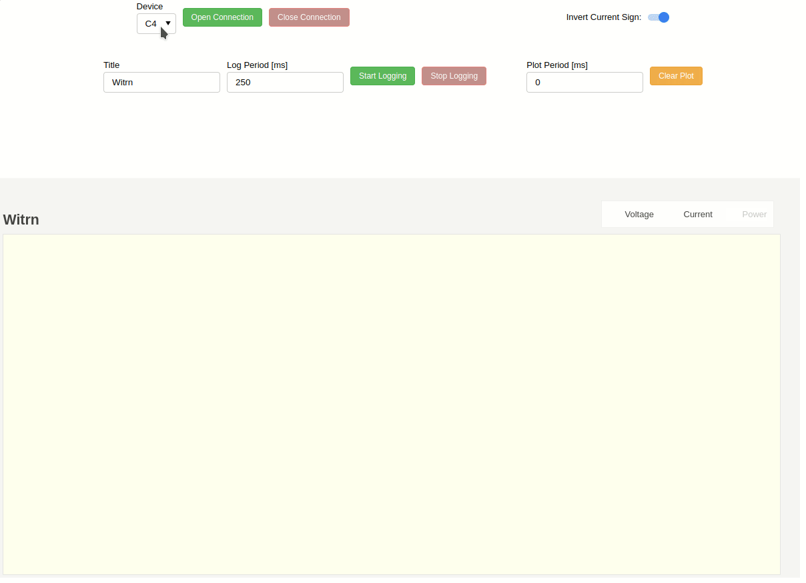

# WITRN UI BOKEH

The code on this repository builds upon the existing Python driver-functionality of [witrn-ui](https://github.com/didim99/witrn-ui) by [didim99](https://github.com/didim99), by adding real-time plotting (and logging) functionality using [Bokeh](http://bokeh.org/). The result allows the user to control a WITRN USB-meter to be controlled using a web-browser.

Currently the code has only been tested using a WITRN C4. Functionality was tried to be added for the U2P but on first glance its protocol (see [this](https://wiki.cuvoodoo.info/doku.php?id=web-u2) and [this](https://git.cuvoodoo.info/kingkevin/web-u2/src/branch/master/u2_usb.c)) seems to be different.

<br>

## 1 - Installation

### 1.1 - Install required packages

```bash
pip install -r requirements.txt
```

**NOTE:** The `requirements.txt` file is generated by running `pipreqs` (`pip install pipreqs`) in the project directory. `~=` means *compatible version*.

<br>

### 1.2 - Configure platform-dependent functionality

#### 1.2.1 - Linux

Copy the udev-rules-file to the correct location.

```bash
sudo cp udev/90-usbmeter.rules /etc/udev/rules.d/90-usbmeter.rules
```

<br>

Restart the udev management tool.

```bash
sudo udevadm control --reload-rules
sudo udevadm trigger
```

<br>

#### 1.2.2 - Windows

Use [Zadig](https://zadig.akeo.ie/) to replace Windows's default HID-driver to `libusbK`.

1. Run `zadig-2.8.exe`
2. Click on `Options` > `List All Devices`
3. Select the `WITRN.C4` device (in case the [Witrn C4](https://aliexpress.com/item/1005004748597690.html) is used)
4. Select `libusbK (v3.0.7.0)` above the `Replace Driver` button
5. Click on `Replace Driver`
6. Confirm the driver replacement operation, wait for the tool to finish

<br>

## 2 - Running

Running `witrn-ui-bokeh.py` *as-is* with Python won't do anything. It is supposed to be launched using [Bokeh server](https://docs.bokeh.org/en/latest/docs/user_guide/server/server_introduction.html#ug-server-introduction) (`bokeh serve`), which creates (and opens, on [http://localhost:5006/witrn-ui-bokeh](http://localhost:5006/witrn-ui-bokeh)) an interactive web application that connects front-end UI events to running Python code. The correct usage is shown below.

```bash
bokeh serve --show witrn-ui-bokeh.py
```

<br>

Once the web-interface opens, use the following steps.

1. Select a **Device** using the dropdown (`C4` selected by default).
   - Depending on the way the current will flow/flows through the USB-meter, disable (default enabled) the **Invert Current Sign** logic using the corresponding toggle-switch.
2. Click on <kbd>Open Connection</kbd>
   - Change the **Plot Period \[ms\]** to a value greater than `0` if the measurement-throughput is too/unnecessary high (the tool defaults to (try to) plot all incoming measurements, a non-zero value only plots incoming measurements at the defined period)
   - Click on <kbd>Clear Plot</kbd> to clear all of the already plotted measurements (the tool only keeps `6000` (configurable, using `MAX_X_POINTS` in [witrn-ui-bokeh.py](witrn-ui-bokeh.py)) data-points on the X-axis (per data-line) before discarding old data, in an attempt to maintain a somewhat responsive real-time application)
   - Click on an item in the **Legend** to enable or disable the display of certain lines on the plot
3. Use the tooltips on the side (activated when hovering over the plot) to zoom in or out on the measurements, ...
4. Change the plot- and file- **Title** and **Log Period \[ms\]** using the corresponding fields (if necessary), click on <kbd>Start Logging</kbd> to start saving values to a `.csv`-file.
   - The generated file has the following syntax (`DateTime` corresponds to the time at which the button has been pressed): `YYYY-MM-DD_HH-MM-SS_<Title>.csv`

<br>

Usage sample:



<br>

## 3 - TODO

- Add functionality to re-plot stored CSV-data
- Add functionality to "download" offline recordings from the USB-meter
- Implement U2P functionality
